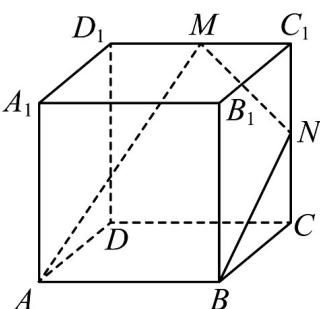
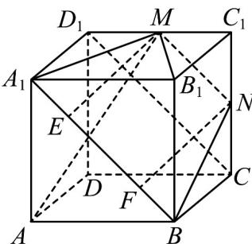

> [!faq]- 《专题17_空间直线_平面的平行_面面平行_高效培优期中专项训练_数学人》官方解析
>
> > [!success]- **【答案】**  A. 直线 $BN$ 与 $MB_{1}$ 是异面直线 B. 直线 $AM$ 与 $BN$ 是平行直线 C. 三棱柱 $AA_{1}D_{1} - BB_{1}C_{1}$ 的外接球的表面积为 $3\pi$ D. 平面 $BMN$ 截正方体所得的截面面积为 $\frac{9}{2}$
>
> > [!note]- **【解析】**
> > 对于 A 选项，因为 $BN \subset$ 平面 $BB_{1}C_{1}C$ ， $B_{1} \in$ 平面 $BB_{1}C_{1}C$ ， $M \notin$ 平面 $BB_{1}C_{1}C$
> >
> > 由异面直线的定义可知，直线 BN 与 $MB_{1}$ 是异面直线， $^{A}$ 对；
> >
> > 对于 $^{B}$ 选项，假设直线AM与BN是平行直线，则A、M、B、N四点共面，
> >
> > 因为平面 $AA_{1}B_{1}B //$ 平面 $CC_{1}D_{1}D$ ，平面 $ABNM \cap$ 平面 $AA_{1}B_{1}B = AB$
> >
> > 平面 $ABNM \cap$ 平面 $CC_{1}D_{1}D = MN$ ，所以， $MN // AB$
> >
> > 又因为 $C_{1}D_{1}//AB$ ，所以， $C_{1}D_{1}//MN$ ，这与 $MN\cap C_{1}D_{1}=M$ 矛盾，
> >
> > 假设不成立，故 AM 与 BN 不平行， $^{B}$ 错；
> >
> > 对于 $C$ 选项，正方体 $ABCD - A_{1}B_{1}C_{1}D_{1}$ 的外接球半径为 $R = \frac{\sqrt{3}}{2} AB = \sqrt{3}$
> >
> > 即三棱柱 $AA_{1}D_{1}-BB_{1}C_{1}$ 的外接球的半径为 $\sqrt{3}$ ，该球的表面积为 $4\pi R^{2}=12\pi$ ，C 错；
> >
> > 对于 D 选项，连接 $CD_{1}$
> >
> > 
> >
> > 在正方体 $ABCD - A_{1}B_{1}C_{1}D_{1}$ 中， $BC \parallel A_{1}D_{1}$ 且 $BC = A_{1}D_{1}$ ，
> >
> > 所以，四边形 $A_{1}BCD_{1}$ 为平行四边形，则 $A_{1}B//CD_{1}$
> >
> > 因为 M 、 N 分别为 $C_{1}D_{1}$ 、 $CC_{1}$ 的中点，
> >
> > 所以， $MN//CD_{1}$ 且 $MN=\frac{1}{2}CD_{1}=\frac{1}{2}\sqrt{CC_{1}^{2}+C_{1}D_{1}^{2}}=\frac{1}{2}\sqrt{2^{2}+2^{2}}=\sqrt{2}$ ，
> >
> > 故 $MN / / AB_{1}$ 且 $AB_{1} = \sqrt{2} AB = 2\sqrt{2}$ ，故 $A_{1}$ 、 $B$ 、 $N$ 、 $M$ 四点共面，
> >
> > 所以，平面BMN截正方体 $ABCD - A_{1}B_{1}C_{1}D_{1}$ 所得截面图形为梯形 $A_{1}B_{1}NM$
> >
> > 由勾股定理可得 $BN = \sqrt{BC^{2} + CN^{2}} = \sqrt{2^{2} + 1^{2}} = \sqrt{5}$ ，同理可得 $A_{1}M = \sqrt{5}$ ，
> >
> > 故梯形 $A_{1}B_{1}NM$ 为等腰梯形，
> >
> > 过点 M 、 N 分别在平面 $A_{1}B_{1}NM$ 内作 $ME \perp A_{1}B_{1}$ ， $NF \perp A_{1}B_{1}$ ，垂足分别为点 E 、 F ，
> >
> > 在 $\mathrm{Rt}^{\triangle}A_{1}ME$ 和 $\mathrm{Rt}^{\triangle}BNF$ 中， $A_{1}M = BN$ ， $\angle MA_{1}E = \angle NBF$ ， $\angle A_{1}EM = \angle BFN = 90^{\circ}$
> >
> > 所以， $\triangle A_{1}ME \cong \triangle BNF$ ，所以， $A_{1}E = BF$
> >
> > 在梯形 $A_{1}B_{1}NM$ 内，因为 $MN//EF$ ， $ME \perp A_{1}B_{1}$ ， $NF \perp A_{1}B_{1}$ ，
> >
> > 所以，四边形 $EFNM$ 为矩形，故 $EF = MN = \sqrt{2}$
> >
> > 所以， $A_{1}M = BN = \frac{A_{1}B_{1} - EF}{2} = \frac{\sqrt{2}}{2}$ ，故 $ME = \sqrt{A_1M^2 - A_1E^2} = \sqrt{5 - \left(\frac{\sqrt{2}}{2}\right)^2} = \frac{3\sqrt{2}}{2}$
> >
> > 所以，梯形 $A_{1}B_{1}NM$ 的面积为 $S_{\text{梯形} A_{1}B_{1}NM} = \frac{(A_{1}B_{1} + MN) \cdot ME}{2} = \frac{(2\sqrt{2} + \sqrt{2}) \times \frac{3\sqrt{2}}{2}}{2} = \frac{9}{2}$ ，
> >
> > 故平面 BMN 截正方体所得的截面面积为 $\frac{9}{2}$ ，D 对·
> >
> > 故选 **AD**.
