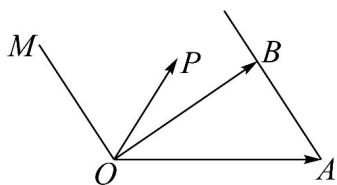

<!-- question-source:start -->
5．如图， $OM // AB$ ，点 $P$ 在由射线 $OM$ 、线段 $OB$ 及 $AB$ 的延长线围成的区域（含边界）运动，且

$\square\square\square\square$ OP = - $\frac{1}{2}$ $\square\square\square\square$ OA + yOB ，则 y 的最大值是 \_\_\_\_ .

<!-- question-source:end -->

![[高中/课堂同步/题库/人教A版高中数学同步讲义(2026)/02_必修第二册/期中专项训练+期中模拟卷/专项训练/专题20_平面向量精选压轴60题12类考点专练_高效培优期中专项训练_/_compact/answers/Q00064240A1.md]]
