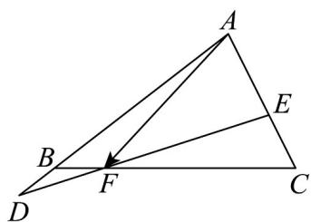

<!-- question-source:start -->
26. 如图，设 $\overline{AB} = x\overline{AD},\overline{AC} = y\overline{AE},(x > 0,y > 0)$ ，线段 $DE$ 与 $BC$ 交于点 $_F$ ，且 $\overline{BF} = \frac{1}{5}\overline{BC}$ ，通过计算得

到： $\frac{1}{5}yAE+\frac{4}{5}xAD,\quad\frac{1}{x}+\frac{4}{y}$ 的最小值为（）

A. $\frac{12}{5}$ B. $\frac{8}{5}$ C. $\frac{16}{5}$ D. $\frac{9}{5}$
<!-- question-source:end -->

![[高中/课堂同步/题库/人教A版高中数学同步讲义(2026)/02_必修第二册/期中专项训练+期中模拟卷/专项训练/专题20_平面向量精选压轴60题12类考点专练_高效培优期中专项训练_/_compact/answers/Q00064258A1.md]]
