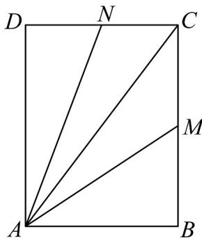

<!-- question-source:start -->
32．如图，矩形ABCD中， $AB = 3$ ， $AD = 4$ ， $M$ 、 $N$ 分别为线段BC、 $CD$ 上的点，且满足

$\frac{1}{CM^2} + \frac{1}{CN^2} = 1$ ，若 $AC = xAM + yAN$ ，则 $x + y$ 的最小值为 \_\_\_\_.

<!-- question-source:end -->

![[高中/课堂同步/题库/人教A版高中数学同步讲义(2026)/02_必修第二册/期中专项训练+期中模拟卷/专项训练/专题20_平面向量精选压轴60题12类考点专练_高效培优期中专项训练_/_compact/answers/Q00064264A1.md]]
