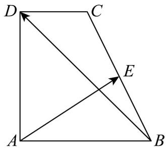

<!-- question-source:start -->
49．如图，在梯形ABCD中， $\overline{AB}=2\overline{DC}$ ， $\angle BAD=90^{\circ}$ ，AB=AD=2，E为线段BC的中点，记 $\overline{AB}=a$

$$
A D = b
$$

(1)用 a，b 表示向量 $\overline{AE}$ 和 $\overline{BD}$ ；

(2)求 $AE$ 与 $BD$ 夹角的余弦值.
<!-- question-source:end -->

![[高中/课堂同步/题库/人教A版高中数学同步讲义(2026)/02_必修第二册/期中专项训练+期中模拟卷/专项训练/专题20_平面向量精选压轴60题12类考点专练_高效培优期中专项训练_/_compact/answers/Q00064281A1.md]]
