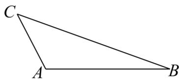

<!-- question-source:start -->
55. 在 $\triangle ABC$ 中，已知 $AB = 2$ ， $AC = 1$ ， $\overline{AB} \cdot \overline{AC} = -1$ ， $\overline{CP} = \lambda \overline{CB} (0 \leq \lambda \leq 1)$ ， $Q$ 为线段 $CA$ 延长线上的一点，且 $\overline{AQ} = t \overline{AC} (t < 0)$ .

(1)当 $t = -1$ 且 $\lambda = \frac{1}{2}$ ，设 $PQ$ 与 $AB$ 交于点 $M$ ，求线段 $CM$ 的长；

(2)若 $PA \cdot PQ + 3 = AP \cdot AB$ ，求 $t$ 的最大值.
<!-- question-source:end -->

![[高中/课堂同步/题库/人教A版高中数学同步讲义(2026)/02_必修第二册/期中专项训练+期中模拟卷/专项训练/专题20_平面向量精选压轴60题12类考点专练_高效培优期中专项训练_/_compact/answers/Q00064287A1.md]]
