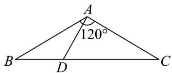

<!-- question-source:start -->
56．如图所示，在VABC中， $\angle BAC=120^{\circ}$ ，AB=AC=3，点D在线段BC上，且DC=2BD．求：

(1)AD的长；

(2) $\angle DAC$ 的大小.
<!-- question-source:end -->

![[高中/课堂同步/题库/人教A版高中数学同步讲义(2026)/02_必修第二册/期中专项训练+期中模拟卷/专项训练/专题20_平面向量精选压轴60题12类考点专练_高效培优期中专项训练_/_compact/answers/Q00064288A1.md]]
