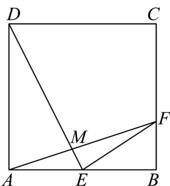

<!-- question-source:start -->
57. 如图，正方形 $ABCD$ 中， $E$ 是 $AB$ 的中点， $F$ 是 $BC$ 边上靠近点 $B$ 的三等分点， $AF$ 与 $DE$ 交于点 $M$ .

(1)设 $EF = xBA + yBC$ ，求 $x + y$ 的值；

(2)求 $\angle AME$ 的余弦值；

(3)求 $DM:ME$ 和 $AM:MF$ .
<!-- question-source:end -->

![[高中/课堂同步/题库/人教A版高中数学同步讲义(2026)/02_必修第二册/期中专项训练+期中模拟卷/专项训练/专题20_平面向量精选压轴60题12类考点专练_高效培优期中专项训练_/_compact/answers/Q00064289A1.md]]
