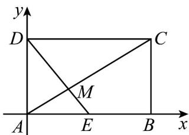

<!-- question-source:start -->
58．如图所示，矩形ABCD的顶点A与坐标原点重合，B，D分别在x，y轴正半轴上，AB=4，AD=2

点 $E$ 为 $AB$ 上一点

(1)若 $DE \perp AC$ ，求 $AE$ 的长；

(2)若 E 为 AB 的中点，AC 与 DE 的交点为 M，求 $\cos\angle CME$
<!-- question-source:end -->

![[高中/课堂同步/题库/人教A版高中数学同步讲义(2026)/02_必修第二册/期中专项训练+期中模拟卷/专项训练/专题20_平面向量精选压轴60题12类考点专练_高效培优期中专项训练_/_compact/answers/Q00064290A1.md]]
