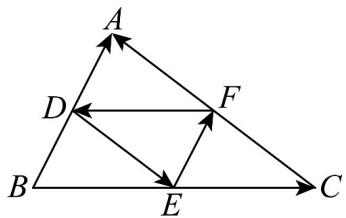
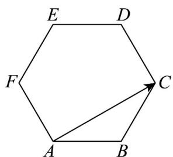

> [!faq]- 《专题20_平面向量精选压轴60题12类考点专练_高效培优期中专项训练_》官方解析
>
> > [!success]- **【答案】**  A. $FD + DA = FA$ B. $FD + DE + EF = 0$ C. $DE + DA = EC$ D. $DA + DE = FD$
>
> > [!note]- **【分析】**
> > 根据向量加法的运算法则逐项判断即可.
>
> > [!note]- **【解析】**
> > 因为 D，E，F 分别是 VABC 的边 AB，BC，CA 的中点，所以 $DE \parallel AC$ ， $DE = \frac{1}{2} AC$ ，即 DE
> >
> > $\| AF$ ，且 $DE = AF$
> >
> > 所以四边形 ADEF 是平行四边形
> >
> > 由向量加法的三角形法则可得， $FD + DA = FA$ ， $FD + DE + EF = 0$
> >
> > 由向量加法的平行四边形法则可得， $\overline{DE}+\overline{DA}=\overline{DF}=\overline{EC}$ ， $\overline{DA}+\overline{DE}=\overline{DF}\neq\overline{FD}$
> >
> > 所以 A, B, C 正确；D 错误.
> >
> > 故选：D.
> >
> > 
