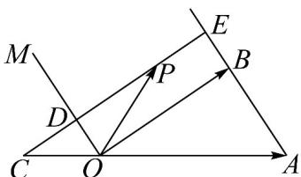

> [!faq]- 《专题20_平面向量精选压轴60题12类考点专练_高效培优期中专项训练_》官方解析
>
> > [!success]- **【答案】** $\frac{3}{2} / 1.5$
>
> > [!note]- **【分析】**
> > 利用向量加法的几何意义直接求解.
>
> > [!note]- **【解析】**
> > 由题意： $OM // AB$ ，点 $P$ 在由射线 $OM$ 、线段 $OB$ 及 $AB$ 的延长线围成的区域（含边界）运动，且
> >
> > $\overline{OP} = -\frac{1}{2}\overline{OA} + yOB$ ，由向量加法的平行四边形法则，OP为平行四边形的对角线，该四边形应是以OB和OA
> >
> > 的反向延长线为两邻边.
> >
> > 
> >
> > 当 $OP = -\frac{1}{2} OA + yOB$ 时,要使 $P$ 点落在指定区域内,即 $P$ 点应落在线段 $DE$ 上(含端点 $D,E$ ).
> >
> > 因为 CD // OB, 所以 $\triangle OCD \sim \triangle AOB$ .
> >
> > 因为 $OC = \frac{1}{2}OA$ ，所以 $CD = \frac{1}{2}OB$ 。
> >
> > 所以 $CE=\frac{3}{2}OB$ .
> >
> > 所以 y 的取值范围是 $\left[\frac{1}{2}, \frac{3}{2}\right]$ .
> >
> > 所以 $y$ 的最大值是 $\frac{3}{2}$
> >
> > 故答案为： $\frac{3}{2}$
> >
> > 题型二 向量的线性运算几何应用（共5小题）
