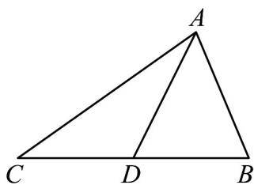

> [!faq]- 《专题20_平面向量精选压轴60题12类考点专练_高效培优期中专项训练_》官方解析
>
> > [!success]- **【答案】** A．两个具有共同终点的向量，一定是共线向量 B．若a与b同向，且 $|a|>|b|$ ，则a>b C． $\lambda$ 、 $\mu$ 为实数，若 $\lambda a=\mu b$ ，则a与b共线 D．P是VABC所在平面上的任意一点，且满足 $OP=\overline{OA}+\lambda(\overline{AB}+\overline{AC})$ ， $\lambda\in(0,+\infty)$ ，则直线AP一定 通过VABC的重心
>
> > [!note]- **【分析】**
> > 根据向量的有关性质判断 A、B；特殊值 $\lambda = \mu = 0$ ，即可判断 C；取 BC 中点 D，应用向量加减
> > 的几何意义得到 $\overline{AP}=2\lambda\overline{AD}$ ，即可判断D.
>
> > [!note]- **【解析】**
> > A，当两起点与终点不在同一直线上时，虽然终点相同，向量不共线，错，
> >
> > B，两个向量不能比较大小，错，
> >
> > C，当 $\lambda = \mu = 0$ 时， $a$ 与 $b$ 可以为任意向量，满足 $\lambda a = \mu b$ ，但 $a$ 与 $b$ 不一定共线，错，
> >
> > D，如图所示，取BC中点D， $\overline{OP}=\overline{OA}+\lambda(\overline{AB}+\overline{AC})$ ，即 $\overline{OP}-\overline{OA}=\lambda(\overline{AB}+\overline{AC})$
> >
> > $\therefore AP=2\lambda AD$ ，即 A、P、D 三点共线，故 AP 一定通过 VABC 的重心，对
> >
> > 
> >
> > 故选 **ABC**
