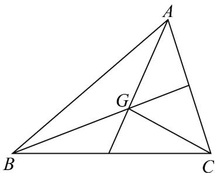

> [!faq]- 《专题20_平面向量精选压轴60题12类考点专练_高效培优期中专项训练_》官方解析
>
> > [!success]- **【答案】** A． $\overline{GA} + \overline{GB} + \overline{GC} = 0$ B． $N$ 为VABC内心 C． $\overline{OG} = \frac{1}{2} \overline{GN}$ D．对于VABC平面内任意一点 $P$ ，总有
>
> > [!note]- **【分析】**
> > 根据三角形内心、外心、重心的几何性质及向量的几何关系得到相关向量的线性关系，判断各
> >
> > 项的正误.
>
> > [!note]- **【解析】**
> > A：由 $G$ 为 $\mathrm{V}ABC$ 的重心，则 $\frac{3}{2} AG = \frac{1}{2}(AB + AC)$ ， $\frac{3}{2} CG = \frac{1}{2}(CA + CB)$ ， $\frac{3}{2} BG = \frac{1}{2}(BA + BC)$
> >
> > 所以 $\frac{3}{2}(AG+CG+BG)=\frac{1}{2}(AB+AC+CA+CB+BA+BC)=0$ ，即 $\overline{GA+GB+GC}=0$ ，正确；
> >
> > 
> >
> > B： $\overline{ON}-\overline{OA}=\overline{OB}+\overline{OC}\Rightarrow\overline{AN}=\overline{OB}+\overline{OC}$ ，由O为外心，所以 $\left(\overline{OB}+\overline{OC}\right)\perp\overline{BC}$
> >
> > 即 $AN \perp BC$ ，同理 $BN \perp AC, CN \perp AB$ ，故 $N$ 为垂心，错误.
> >
> > C : $OG = OA + AG = OB + BG = OC + CG$ ，所以 $3OG = OA + OB + OC + AG + BG + CG$
> >
> > 因为 $AG + BG + CG = 0$ ，故 $OG = \frac{1}{3}\left(OA + OB + OC\right)$ ，而 $ON = OA + OB + OC$ ，
> >
> > 所以 $OG = \frac{1}{3}ON = \frac{1}{3}\left(OG + GN\right)$ ，即 $OG = \frac{1}{2}GN$ ，正确.
> >
> > D : $PG = PA + AG = PB + BG = PC + CG$ ，所以 $3PG = PA + PB + PC + AG + BG + CG$ ，
> >
> > 因为 $AG + BG + CG = 0$ ，故 $PG = \frac{1}{3} \left( PA + PB + PC \right)$ ，正确.
> >
> > 故选 **ACD**
