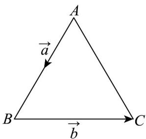

> [!faq]- 《专题20_平面向量精选压轴60题12类考点专练_高效培优期中专项训练_》官方解析
>
> > [!success]- **【答案】** CD
>
> > [!note]- **【分析】**
> > 由题意知 $\left|a\right|=1,\left|b\right|=2$ ，a与b的夹角是 $120^{\circ}$ ，可判断B；利用向量数量积的公式可判断D；利用模长公式可判断A；证明 $(4a+b)\cdot b=0$ 可判断C.
>
> > [!note]- **【解析】**
> > 由题意知 $|a|=1$ ， $|b|=2$ ，a与b的夹角是 $120^{\circ}$ ，故B错误；
> >
> > $\vec{a}\cdot\vec{b}=\left|a\right|\left|b\right|\cos120^{\circ}=1\times2\times\left(-\frac{1}{2}\right)=-1$ ，故D正确；
> >
> > $$
> > \left(\overrightarrow {a + b}\right) ^ {2} = a ^ {2} + b ^ {2} + 2 a \cdot b = 1 + 4 + 2 \times (- 1) = 3
> > $$
> >
> > 所以 $\left|a+b\right|=\sqrt{3}$ ，故 A 错误；
> >
> > $$
> > (4 a + b) \cdot b = 4 a \cdot b + b ^ {2} = 4 \times (- 1) + 4 = 0
> > $$
> >
> > 所以 $\left(4a + b\right) \perp b$ ，故C正确.
> >
> > 
