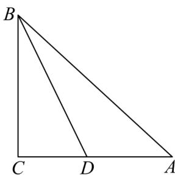

> [!faq]- 《专题20_平面向量精选压轴60题12类考点专练_高效培优期中专项训练_》官方解析
>
> > [!success]- **【答案】** $\sqrt{19}$
>
> > [!note]- **【分析】**
> > 设 $\overline{AD} = t\overline{AC}$ ，得到 $\left|\overline{AB} - t\overline{AC}\right| = \left|\overline{DB}\right|$ $\left|\overline{CB}\right|$ 恒成立，得出 $AC \perp BC$ ，根据题意，结合勾股定理，
> > 得到 $\left|BC\right|=\sqrt{\left|AB\right|^{2}-\left|AC\right|^{2}}$ ，即可求解.
>
> > [!note]- **【解析】**
> > 设 $\overline{AD} = t\overline{AC}$ ，如图所示，
> >
> > 因为对任意的实数 $t$ ，都有 $\left|AB - tAC\right|$ $\left|AB - AC\right|$ 恒成立，
> >
> > 由 $\left|\overline{AB} - t\overline{AC}\right| = \left|\overline{AB} - \overline{AD}\right| = \left|\overline{DB}\right|$ $|CB|$ 恒成立，则 $AC \perp BC$
> >
> > 因为 $\overline{AB} = (2m, m + 5)$ ， $\overline{AC} = (\cos \alpha, \sin \alpha)$ ，所以 $\left|\overline{AB}\right| = \sqrt{5(m + 1)^2 + 20}$ ， $\left|\overline{AC}\right| = 1$ ，所以
> >
> > $$
> > \left| B C \right| = \sqrt {\left| A B \right| ^ {2} - \left| A C \right| ^ {2}} = \sqrt {5 (m + 1) ^ {2} + 2 0 - 1} \quad \sqrt {2 0 - 1} = \sqrt {1 9}
> > $$
> >
> > 当且仅当 m = -1 时，等号成立.
> >
> > 故答案为： $\sqrt{19}$
> >
> > 
