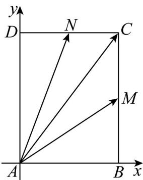

> [!faq]- 《专题20_平面向量精选压轴60题12类考点专练_高效培优期中专项训练_》官方解析
>
> > [!success]- **【答案】** $\frac{5}{4}$
>
> > [!note]- **【分析】**
> > 建立直角坐标系，确定向量坐标，根据 $\overline{AC}=x\overline{AM}+y\overline{AN}$ 得到 $b=\frac{3-3x}{y}$ ， $a=\frac{4-4y}{x}$ ，根据
> >
> > $\frac{1}{CM^2} + \frac{1}{CN^2} = 1$ 得到 $\frac{x^2}{16} + \frac{y^2}{9} = (x + y - 1)^2$ ，变换 $x + y = m$ ，计算 $\Delta_0$ 得到答案.
>
> > [!note]- **【解析】**
> > 由题意，易知 $x, y$ 不为0，建立如图所示坐标系，
> >
> > 
> >
> > 设点 $M(3,a)$ ， $N(b,4)$ ， $0\leq a <   4$ ， $0\leq b <   3$
> >
> > $$
> > \stackrel {{\square \sqcup \sqcup}} {{A C}} = (3, 4) \quad \stackrel {{\square \sqcup \sqcup \sqcup}} {{A M}} = (3, a) \quad \stackrel {{\square \sqcup \sqcup}} {{A N}} = (b, 4),
> > $$
> >
> > $\overset{\square\square\square}{AC}=x\overset{\square\square\square\square}{AM}+y\overset{\square\square\square}{AN},(3,4)=x(3,a)+y(b,4)$ ，即 $\left\{\begin{aligned}&3=3x+yb\\&4=xa+4y\end{aligned}\right.$
> >
> > $$
> > b = \frac {3 - 3 x}{y} \quad a = \frac {4 - 4 y}{x}
> > $$
> >
> > $$
> > \frac {1}{C M ^ {2}} = \frac {1}{(4 - a) ^ {2}} = \frac {1}{1 6} \frac {x ^ {2}}{(x + y - 1) ^ {2}}, \frac {1}{C N ^ {2}} = \frac {1}{(3 - b) ^ {2}} = \frac {1}{9} \frac {y ^ {2}}{(x + y - 1) ^ {2}}
> > $$
> >
> > 故 $\frac{1}{16}\frac{x^2}{(x + y - 1)^2} +\frac{1}{9}\frac{y^2}{(x + y - 1)^2} = 1$ ，即 $\frac{x^2}{16} +\frac{y^2}{9} = (x + y - 1)^2$
> >
> > 设 $x + y = m$
> >
> > 当 $M, N, C$ 三点共线时 $x + y = 1$ ， $A, C$ 在直线 $MN$ 的异侧，故 $m > 1$ ，则 $x = m - y$
> >
> > 则 $\frac{(m - y)^2}{16} +\frac{y^2}{9} = (m - 1)^2$ ，即 $25y^{2} - 18my + 9m^{2} - 144(m - 1)^{2} = 0$
> >
> > 故 $\Delta = (18m)^2 - 4 \times 25 \times (9m^2 - 144(m - 1)^2) \quad 0$ ，即 $24m^2 - 50m + 25 \quad 0$ ，
> >
> > 解得 $m \frac{5}{4}$ 或 $m \mathfrak{£} \frac{5}{6}$ （舍去）；
> >
> > 故答案为： $\frac{5}{4}$
