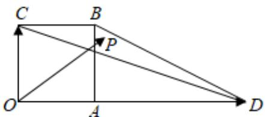
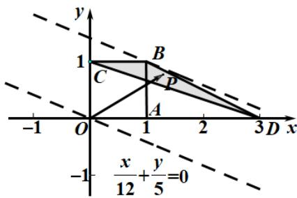

> [!faq]- 《专题20_平面向量精选压轴60题12类考点专练_高效培优期中专项训练_》官方解析
>
> > [!success]- **【答案】**  A. $\frac{1}{4}$ B. $\frac{9}{20}$ C. $\frac{3}{4}$ D. $\frac{17}{60}$
>
> > [!note]- **【解析】**
> > 以 $O$ 为原点， $OD, OC$ 为 $x, y$ 轴建立如图所示的平面直角坐标系：
> >
> > 
> >
> > 因为四边形 $OABC$ 是边长为1的正方形， $OD = 3$
> >
> > 所以 $D(3,0)$ ， $C(0,1)$ ， $B(1,1)$ ，
> >
> > $OD = (3,0)$ $OC = (0,1)$
> >
> > 所以 $OP = \alpha OC + \beta OD = (0, \alpha) + (3\beta, 0) = (3\beta, \alpha)$
> >
> > 设 $P(x,y)$ ，则 $\left\{ \begin{array}{l}x = 3\beta \\ y = \alpha \end{array} \right.$ ，所以 $\left\{ \begin{array}{l}\beta = \frac{x}{3}\\ \alpha = y \end{array} \right.$
> >
> > 所以 $\frac{\alpha}{5} +\frac{\beta}{4} = \frac{y}{5} +\frac{x}{12}$ ，即求 $z = \frac{x}{12} +\frac{y}{5}$ 的最大值，
> >
> > 因为点 P 为 $\triangle BCD$ 内（含边界）的动点，
> >
> > 所以由图可知，平移直线 $\frac{x}{12} +\frac{y}{5} = 0$ 到经过点 $B(1,1)$ 时， $z = \frac{x}{12} +\frac{y}{5}$ 取得最大值 $\frac{17}{60}$ 所以 $\frac{\alpha}{5} +\frac{\beta}{4}$ 的最大值是 $\frac{17}{60}$
> >
> > 故选 **D**
