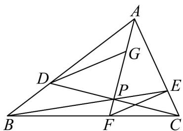

> [!faq]- 《专题20_平面向量精选压轴60题12类考点专练_高效培优期中专项训练_》官方解析
>
> > [!success]- **【答案】** (1) $CD=\frac{2}{3}a-b,BE=-a+\frac{3}{4}b$ ; (2) $\frac{1}{6}$ ; (3) $\frac{2}{3}$ .
>
> > [!note]- **【分析】**
> > （1）根据给定条件，利用向量减法及数乘向量求解.
> >
> > (2) 利用共线向量定理的推论及向量基本定理求解.
> >
> > (3) 利用共线向量定理及向量基本定理列式求解.
>
> > [!note]- **【解析】**
> > （1）在VABC中， $\overline{AD}=2\overline{DB}$ ， $\overline{AE}=3\overline{EC}$
> >
> > 所以 $CD = AD - AC = \frac{2}{3}AB - AC = \frac{2}{3}a - b$ ， $BE = AE - AB = \frac{3}{4}AC - AB = -a + \frac{3}{4}b$ .
> >
> > (2) 由点 P 在线段 BE 上，设 $\overline{AP} = \lambda \overline{AB} + (1 - \lambda) \overline{AE}, 0 < \lambda < 1$
> >
> > 则 $AP = \lambda \cdot \frac{3}{2} AD + (1 - \lambda) \cdot \frac{3}{4} AC = \frac{3}{2}\lambda AD + \frac{3}{4}(1 - \lambda)AC$ ，而 $C, P, D$ 共线，
> >
> > 因此 $\frac{3}{2}\lambda +\frac{3}{4} (1 - \lambda) = 1$ ，解得 $\lambda = \frac{1}{3}$ ，于是 $AP = \frac{1}{3} AB + \frac{2}{3} AE = \frac{1}{3} AB + \frac{2}{3}\cdot \frac{3}{4} AC = \frac{1}{3} a + \frac{1}{2} b$
> >
> > 而 $AP = xa + yb$ ，且 $a,b$ 不共线，则 $x = \frac{1}{3},y = \frac{1}{2}$
> >
> > 所以 $xy = \frac{1}{6}$ .
> >
> > (3) 设 $AF = tAP, t > 1$ ，由 (2) 得 $AF = \frac{t}{3}AB + \frac{t}{2}AC$ ，而 B, F, C 共线，则 $\frac{t}{3} + \frac{t}{2} = 1$
> >
> > 解得 $t=\frac{6}{5}$ ，则 $\overline{AF}=\frac{2}{5}a+\frac{3}{5}b$ ， $\overline{EF}=\overline{AF}-\overline{AE}=\frac{2}{5}a+\frac{3}{5}b-\frac{3}{4}b=\frac{2}{5}a-\frac{3}{20}b$ ，
> >
> > 由点 G 在线段 AP 上，设 $AG = \mu AP$ ，则 $AG = \frac{\mu}{3}a + \frac{\mu}{2}b$ ，
> >
> > $DG = AG - AD = \frac{\mu}{3}a + \frac{\mu}{2}b - \frac{2}{3}a = \frac{\mu - 2}{3}a + \frac{\mu}{2}b$ ，由 $DG // EF$ ，且 $a, b$ 不共线，
> >
> > 得 $\frac{\frac{\mu - 2}{3}}{\frac{2}{5}} = \frac{\frac{\mu}{2}}{-\frac{3}{20}}$ ，解得 $\mu = \frac{2}{5}$ ，因此 $AG = \frac{2}{5}AP$ ， $GP = \frac{3}{5}AP$ ，
> >
> > 所以 $\left| AG \right| : \left| GP \right| = \frac{2}{3}$ .
> >
> > 
