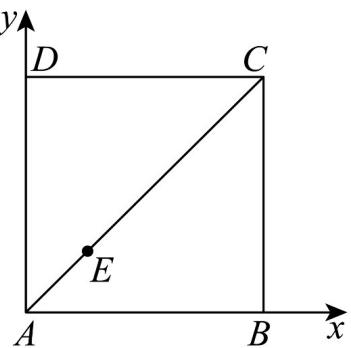
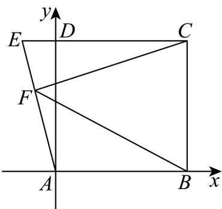

> [!faq]- 《专题20_平面向量精选压轴60题12类考点专练_高效培优期中专项训练_》官方解析
>
> > [!success]- **【答案】** A. 4 B. 2 C. $\frac{1}{2}$ D. $\frac{1}{4}$
>
> > [!note]- **【分析】**
> > 建立平面直角坐标系，根据共线定理表示点 $E$ 的坐标，代入表达式根据二次函数求最值.
>
> > [!note]- **【解析】**
> > 
> >
> > 已知正方形 ABCD，以 AB, AD 建立平面直角坐标系，
> >
> > $A(0,0)$ $B(2,0)$ $D(0,2)$ $C(2,2)$
> >
> > 设 $E(x,y)$ ，点 $E$ 在线段 $AC$ 上， $\overline{AE} = \lambda \overline{AC} (0\leq \lambda \leq 1)$
> >
> > 则 $(x,y) = \lambda (2,2)$ ， $\left\{ \begin{array}{l}x = 2\lambda \\ y = 2\lambda \end{array} \right.$
> >
> > $$
> > A E \cdot B E = (2 \lambda , 2 \lambda) \cdot (2 \lambda - 2, 2 \lambda) = 4 \lambda^ {2} - 4 \lambda + 4 \lambda^ {2} = 8 \lambda^ {2} - 4 \lambda = 8 \left(\lambda - \frac {1}{4}\right) ^ {2} - \frac {1}{2}
> > $$
> >
> > $\lambda=1$ 时， $AE\cdot BE$ 的最大值为 4
> >
> > 2．四边形 ABCD 是边长为 1 的正方形，延长 CD 至 E，使得 $CD = 4DE$ ，若点 F 为线段 AE 上的动点，则$\overline{FB} \cdot \overline{FC}$ 的最小值为（）
> >
> > 【答案】
> > A. $\frac{65}{64}$ B. $\frac{16}{17}$ C. 1 D. $\frac{25}{16}$
> >
> > 【答案】B
> >
> > 【详解】如图，以 $A$ 为原点，建立平面直角坐标系.
> >
> > 
> >
> > 则 $A(0,0)$ ， $B(1,0)$ ， $C(1,1)$ ， $E\left(-\frac{1}{4},1\right)$ .
> >
> > 设 $AF = tAE = t\left(-\frac{1}{4}, 1\right) = \left(-\frac{t}{4}, t\right)$ ， $0 \leq t \leq 1$ .
> >
> > 则 $FB = AB - AF = (1,0) - \left(-\frac{t}{4},t\right) = \left(1 + \frac{t}{4}, - t\right)$
> >
> > $$
> > F C = A C - A F = (1, 1) - \left(- \frac {t}{4}, t\right) = \left(1 + \frac {t}{4}, 1 - t\right)
> > $$
> >
> > 所以 $\vec{FB} \cdot \vec{FC} = \left(1 + \frac{t}{4}\right)^2 + (-t) \cdot (1 - t) = \frac{17}{16} t^2 - \frac{1}{2} t + 1$
> >
> > 所以当 $t=\frac{4}{17}$ 时， $FB\cdot FC$ 取得最小值，为 $\frac{17}{16}\times\left(\frac{4}{17}\right)^{2}-\frac{1}{2}\times\frac{4}{17}+1=\frac{16}{17}$
> >
> > 故答案 B 正确.
