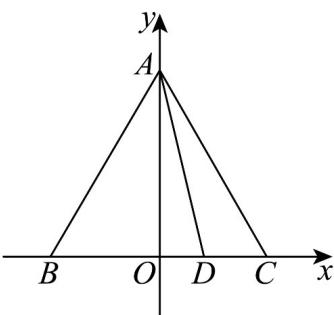

> [!faq]- 《专题20_平面向量精选压轴60题12类考点专练_高效培优期中专项训练_》官方解析
>
> > [!success]- **【答案】** $\frac{2}{3}$ $\frac{11}{12}$
>
> > [!note]- **【分析】**
> > 建立平面直角坐标系，写出 A, B, C, D 点的坐标和 $\overline{AD}, \overline{BC}$ 的坐标，利用数量积的坐标计算公式可求得 $\overline{AD} \cdot \overline{BC}$ ，再设出点 $P(x, y)$ ，根据 $\left(\overline{PA} + \overline{PC}\right) \cdot \overline{AB} = 0$ ，用 y 来表示 x，再将 $\overline{PB} \cdot \overline{PD}$ 表示成关于 y 的函数表达式。然后求解最小值。
>
> > [!note]- **【解析】**
> > 建系如图所示
> >
> > 
> >
> > 因为 VABC 是边长为 2 的等边三角形， $\overline{BD}=2\overline{DC}$ ， $\therefore A(0,\sqrt{3}), B(-1,0), C(1,0), D(\frac{1}{3},0)$ $\overline{AD}=(\frac{1}{3},-\sqrt{3}),\overline{BC}=(2,0),\therefore AD\cdot BC=\frac{2}{3}.$ 设 $P(x,y), x, y \in \mathbb{R}, \therefore \overline{PA} = (-x, \sqrt{3} - y), \overline{PC} = (1 - x, -y), AB = (-1, -\sqrt{3}).$ $PA + PC = (1 - 2x, \sqrt{3} - 2y)$ $(PA + PC) \cdot AB = 2x + 2\sqrt{3}y - 4 = 0, \therefore x = 2 - \sqrt{3}y, \therefore P(2 - \sqrt{3}y, y).$
> >
> > $$
> > P B = (\sqrt {3} y - 3, - y), P D = (\sqrt {3} y - \frac {5}{3}, - y)
> > $$
> >
> > $$
> > \therefore P B \cdot P D = 4 y ^ {2} - \frac {1 4 \sqrt {3}}{3} y + 5 = 4 (y - \frac {7 \sqrt {3}}{1 2}) ^ {2} + \frac {1 1}{1 2}.
> > $$
> >
> > 当 $y=\frac{7\sqrt{3}}{12}$ 时， $PB\cdot PD$ 取得最小值，最小值为 $\frac{11}{12}$ .
