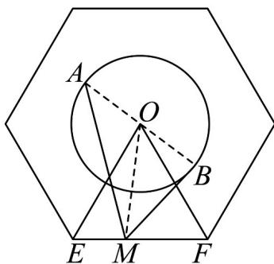

> [!faq]- 《专题20_平面向量精选压轴60题12类考点专练_高效培优期中专项训练_》官方解析
>
> > [!success]- **【答案】** 11
>
> > [!note]- **【解析】**
> > 连接 OE、OF、AB、OM，则 O 为 AB 的中点，利用平面向量数量积的运算性质得出
> >
> > $\overline{MA} \cdot MB = \left| MO \right|^2 - \left| OA \right|^2$ ，数形结合求出 $\left| MO \right|$ 的最大值，即可得出 $\overline{MA} \cdot MB$ 的最大值.
> >
> > 如下图所示，连接 OE、OF、AB、OM，则 O 为 AB 的中点，
> >
> > 则 $\angle EOF = 60^{\circ}$ ，且 $|OE| = |OF|$ ，故 $\triangle EOF$ 是边长为 $2\sqrt{3}$ 的等边三角形，
> >
> > 
> >
> > 易知 $\left|OA\right|=1$ ，则 $MA\cdot MB=\left(MO+OA\right)\cdot\left(MO+OB\right)=\left(MO+OA\right)\cdot\left(MO-OA\right)$
> >
> > $$
> > = \left| \begin{array}{c} \text {   U   U   U   U   U   } \\ M O \end{array} \right| ^ {2} - \left| \begin{array}{c} \text {   U   U   U   U   U   } \\ O A \end{array} \right| ^ {2} = \left| \begin{array}{c} \text {   U   U   U   U   U   U   } \\ M O \end{array} \right| ^ {2} - 1 \leq \left| \begin{array}{c} \text {   U   U   U   U   U   } \\ O E \end{array} \right| ^ {2} - 1 = 1 2 - 1 = 1 1
> > $$
> >
> > 当且仅当 M 与正六边形的顶点重合时， $MA \cdot MB$ 取最大值 11.
