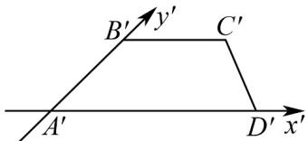

<!-- question-source:start -->
14．如图所示，梯形 $A^{\prime}B^{\prime}C^{\prime}D^{\prime}$ 是平面图形 ABCD 用斜二测画法得到的直观图， $A^{\prime}D^{\prime}=2B^{\prime}C^{\prime}=2$ ， $A^{\prime}B^{\prime}=2$ ，

则 $CD =$ \_\_\_\_；平面图形ABCD以AB所在直线为轴旋转一周所得立体图形的体积为\_\_\_\_。

<!-- question-source:end -->

![[高中/课堂同步/题库/人教A版高中数学同步讲义(2026)/02_必修第二册/期中专项训练+期中模拟卷/专项训练/专题21_立体几何初步及复数精选压轴60题12类考点专练_期中复习专项/_compact/answers/Q00064306A1.md]]
