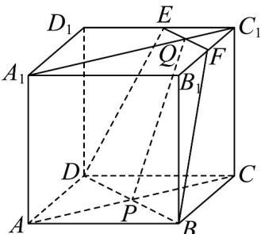

<!-- question-source:start -->
43．在正方体 $ABCD-A_{1}B_{1}C_{1}D_{1}$ 中，E，F 分别为 $D_{1}C_{1}$ ， $B_{1}C_{1}$ 的中点，ACI BD=P， $A_{1}C_{1}\cap EF=Q$ ，如图．

(1)求证： $D$ ， $B$ ， $E$ ， $F$ 四点共面；

(2)作出直线 $A_{1}C$ 与平面 $BDEF$ 的交点 $R$ 的位置.
<!-- question-source:end -->

![[高中/课堂同步/题库/人教A版高中数学同步讲义(2026)/02_必修第二册/期中专项训练+期中模拟卷/专项训练/专题21_立体几何初步及复数精选压轴60题12类考点专练_期中复习专项/_compact/answers/Q00064334A1.md]]
