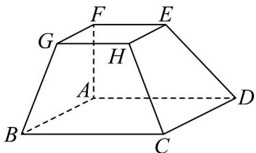

<!-- question-source:start -->
45．如图，在多面体 $ABCDEFGH$ 中，四边形 $ABCD$ 和四边形 $EFGH$ 均为正方形，四边形 $ABGF$ 和四边形

形 ADEF 均为梯形，其中 $AB \parallel FG$ ， $AD \parallel EF$ ，且 AB = 2FG

(1)证明： $B$ ， $D$ ， $E$ ， $G$ 四点共面.

(2)证明： $AF, BG, DE$ 三条直线交于一点.
<!-- question-source:end -->

![[高中/课堂同步/题库/人教A版高中数学同步讲义(2026)/02_必修第二册/期中专项训练+期中模拟卷/专项训练/专题21_立体几何初步及复数精选压轴60题12类考点专练_期中复习专项/_compact/answers/Q00064336A1.md]]
