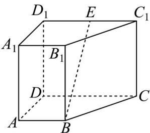

<!-- question-source:start -->
48．如图，在直四棱柱 $ABCD-A_{1}B_{1}C_{1}D_{1}$ 中， $AB//CD$ ， $AD\perp CD$ ，AB=2，AD=3，CD=4.

(1)设 E 是 $C_{1}D_{1}$ 的中点，求证： $BE \parallel$ 平面 $AA_{1}D_{1}D$ ；

(2)若直四棱柱 $ABCD - A_{1}B_{1}C_{1}D_{1}$ 的体积为36，求平面 $D_{1}AC$ 与平面ABCD所成的锐二面角的大小.
<!-- question-source:end -->

![[高中/课堂同步/题库/人教A版高中数学同步讲义(2026)/02_必修第二册/期中专项训练+期中模拟卷/专项训练/专题21_立体几何初步及复数精选压轴60题12类考点专练_期中复习专项/_compact/answers/Q00064339A1.md]]
