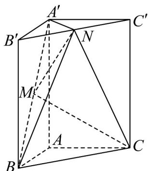

<!-- question-source:start -->
49. 已知直三棱柱 $ABC - A'B'C'$ 满足 $\angle BAC = 90^\circ$ ， $AB = AC = \frac{1}{2} AA' = 2$ ，点 $M$ ， $N$ 分别为 $A'B$ ， $B'C'$ 的

中点·

(1)求证：MN // 平面 $A^{\prime}ACC^{\prime}$ ;

(2)求证： $A^{'}N \perp$ 平面 BCN.

(3)求三棱锥 C-MNB 的体积.
<!-- question-source:end -->

![[高中/课堂同步/题库/人教A版高中数学同步讲义(2026)/02_必修第二册/期中专项训练+期中模拟卷/专项训练/专题21_立体几何初步及复数精选压轴60题12类考点专练_期中复习专项/_compact/answers/Q00064340A1.md]]
