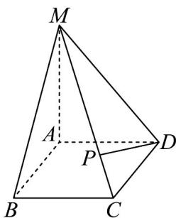

<!-- question-source:start -->
50．如图，在四棱锥 M-ABCD 中， $MA \perp$ 底面 ABCD ，底面 ABCD 是边长为 2 的菱形，

$\angle ABC = 60^{\circ}, MA = 2$ ，点 $P$ 满足 $\overline{MP} = 3PC$

(1)求异面直线 $MB$ 与 $AD$ 所成角的余弦值；

(2)求直线 $PD$ 与底面 $ABCD$ 所成角的正弦值.
<!-- question-source:end -->

![[高中/课堂同步/题库/人教A版高中数学同步讲义(2026)/02_必修第二册/期中专项训练+期中模拟卷/专项训练/专题21_立体几何初步及复数精选压轴60题12类考点专练_期中复习专项/_compact/answers/Q00064341A1.md]]
