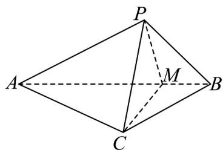

<!-- question-source:start -->
51．如图，在VABC中， $AC \perp BC, AC = 2\sqrt{5}, BC = \sqrt{5}$ . 将VABC以AB为轴旋转至 $\triangle ABP$ ，动点P与原来

的VABC形成三棱锥P-ABC，点M在棱AB上，且BM=1.

(1)证明： $AB\perp$ 平面PCM.

(2)记二面角 $P - AC - B$ 为 $\alpha$ ，二面角 $P - BC - A$ 为 $\beta$ ·证明： $\frac{\tan\beta}{\tan\alpha}$ 为定值；
<!-- question-source:end -->

![[高中/课堂同步/题库/人教A版高中数学同步讲义(2026)/02_必修第二册/期中专项训练+期中模拟卷/专项训练/专题21_立体几何初步及复数精选压轴60题12类考点专练_期中复习专项/_compact/answers/Q00064342A1.md]]
