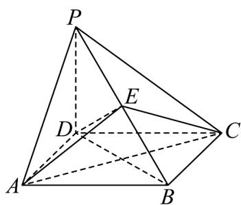

<!-- question-source:start -->
54．如图，在四棱锥 P-ABCD 中， $PD \perp$ 平面 ABCD ，四边形 ABCD 是平行四边形．

(1)若 $E$ 是 $PB$ 上任意一点，四边形ABCD是菱形， $AC = 6$ ， $BD = 6\sqrt{3}$ ，当 $\triangle AEC$ 面积的最小值是9时，

求证： $EC\perp$ 平面 $PAB$ ；

(2)《九章算术》中，将底面为长方形且有一条侧棱与底面垂直的四棱锥称为阳马，将四个面都为直角三

角形的四面体称为鳖臑．若四棱锥 P-ABCD 是阳马，PD=5，CD=4，AD=3，求：该阳马的外接球表面

积；

(3)若四棱锥 $P - ABCD$ 是阳马，且 $PD = CD$ ，点 $E$ 可能为 $PA, PB, PC$ 的中点，试确定点 $E$ 位置使得四面体

$E - BCD$ 为鳖臑，并证明.
<!-- question-source:end -->

![[高中/课堂同步/题库/人教A版高中数学同步讲义(2026)/02_必修第二册/期中专项训练+期中模拟卷/专项训练/专题21_立体几何初步及复数精选压轴60题12类考点专练_期中复习专项/_compact/answers/Q00064344A1.md]]
