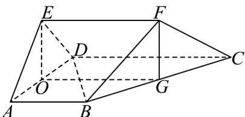

<!-- question-source:start -->
56．如图，在五面体 $ABCDEF$ 中， $AB // CD$ ， $BD \perp BF$ ，平面 $ABFE \cap$ 平面 $CDEF = EF$ ，

$AB = AD = AE = 2$ ， $BC = 2\sqrt{3}$ ， $EF = 3$ ， $\angle BAD = \angle DAE = \frac{\pi}{3}$

(1)证明： $EF \parallel$ 平面 ABCD；

(2)若点 $O$ 、 $G$ 分别为 $AD$ 、 $BC$ 的中点，证明：平面 $EOGF \perp$ 平面 $ABCD$ ；

(3)求该五面体的体积.
<!-- question-source:end -->

![[高中/课堂同步/题库/人教A版高中数学同步讲义(2026)/02_必修第二册/期中专项训练+期中模拟卷/专项训练/专题21_立体几何初步及复数精选压轴60题12类考点专练_期中复习专项/_compact/answers/Q00064346A1.md]]
