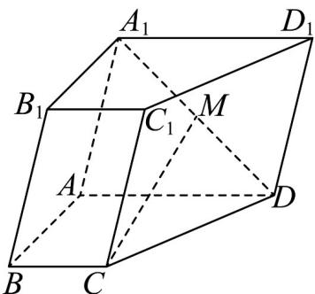

<!-- question-source:start -->
58. 如图，在四棱柱 $ABCD - A_{1}B_{1}C_{1}D_{1}$ 中，底面 $ABCD$ 为直角梯形，其中 $AD \parallel BC$ ，且

$AD = 2BC = 2AB = 4$ $AB\perp AD$ ，四边形 $ABB_{1}A_{1}$ 是菱形， $M$ 为 $A_{1}D$ 的中点．求证： $CM / /$ 平面 $AA_{1}B_{1}B$

<!-- question-source:end -->

![[高中/课堂同步/题库/人教A版高中数学同步讲义(2026)/02_必修第二册/期中专项训练+期中模拟卷/专项训练/专题21_立体几何初步及复数精选压轴60题12类考点专练_期中复习专项/_compact/answers/Q00064348A1.md]]
