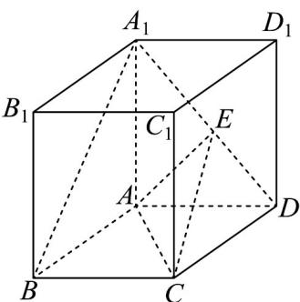

<!-- question-source:start -->
60．如图，四棱柱 $ABCD-A_{1}B_{1}C_{1}D_{1}$ 中，底面四边形 ABCD 为菱形， $\angle ABC=60^{\circ}$ ， $AA_{1}=AC=2$

$A_{1}B = A_{1}D = 2\sqrt{2}$ ，点 E 在线段 $A_{1}D$ 上。

(1)证明： $AA_{1} \perp$ 平面ABCD；

$$
A _ {1} E
$$

(2)当 $\overline{ED}$ 为何值时， $A_{1}B //$ 平面 $EAC$ ，并求出此时三棱锥 $E - ACD$ 的体积.
<!-- question-source:end -->

![[高中/课堂同步/题库/人教A版高中数学同步讲义(2026)/02_必修第二册/期中专项训练+期中模拟卷/专项训练/专题21_立体几何初步及复数精选压轴60题12类考点专练_期中复习专项/_compact/answers/Q00064350A1.md]]
