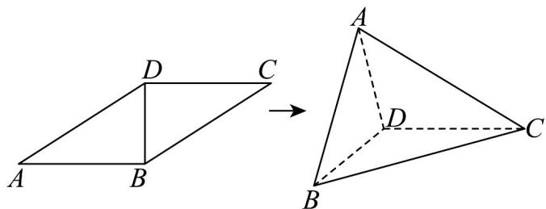

<!-- question-source:start -->
7．如图，在平行四边形ABCD中，已知 $AB=\sqrt{3}$ ，AD=2，BD=1，现将△ABD沿BD折起，得到三棱

锥 A-BCD，且三棱锥 A-BCD 外接球的表面积为 $7\pi$ ，则 AC= \_\_\_\_.

<!-- question-source:end -->

![[高中/课堂同步/题库/人教A版高中数学同步讲义(2026)/02_必修第二册/期中专项训练+期中模拟卷/专项训练/专题21_立体几何初步及复数精选压轴60题12类考点专练_期中复习专项/_compact/answers/Q00064355A1.md]]
