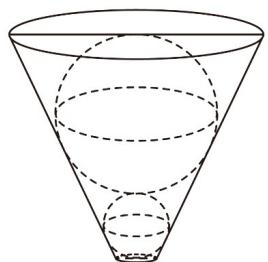

<!-- question-source:start -->
8. 如图，圆台形容器内放进半径分别为2和4的两个实心铁球，小球与容器下底面、容器壁均相切，大

球与小球、容器壁、容器上底面均相切，若向该容器内注满水，则水的体积为\_\_\_\_。

<!-- question-source:end -->

![[高中/课堂同步/题库/人教A版高中数学同步讲义(2026)/02_必修第二册/期中专项训练+期中模拟卷/专项训练/专题21_立体几何初步及复数精选压轴60题12类考点专练_期中复习专项/_compact/answers/Q00064356A1.md]]
