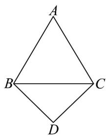
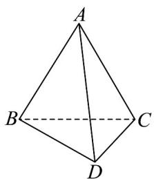

<!-- question-source:start -->
9．如图1所示，在平面四边形ABDC中， $AB = AC = 2$ ， $\angle A = \frac{\pi}{3}$ ， $BD = CD = \sqrt{2}$ ，将VABC沿BC折叠，

得到图2中的三棱锥 $A - BCD$ ，使二面角 $A - BC - D$ 的余弦值为 $-\frac{\sqrt{3}}{3}$ ，则三棱锥 $A - BCD$ 的外接球表面

积为\_\_\_\_。

(1)
(2)

<!-- question-source:end -->

![[高中/课堂同步/题库/人教A版高中数学同步讲义(2026)/02_必修第二册/期中专项训练+期中模拟卷/专项训练/专题21_立体几何初步及复数精选压轴60题12类考点专练_期中复习专项/_compact/answers/Q00064357A1.md]]
