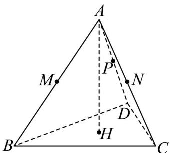

<!-- question-source:start -->
10．如图，在正三棱锥 A-BCD 中，H 为 $\triangle BCD$ 的重心，也为 A 在面 BCD 上的投影．AB 上一点 M 满足

$\overline{AM}=\lambda\overline{AB}$ ，AC 上一点 N 满足 $\overline{AN}=\mu\overline{AC}$ ，且 $\lambda+\mu=1$ ，P 为 AD 中点。

(1)证明： $AD\perp BC$

<!-- source-part:3 pages:101-103 -->

(2)若三棱锥 A-BCD 各棱长均为 2，求 P 到 MN 距离的最小值。
<!-- question-source:end -->

![[高中/课堂同步/题库/人教A版高中数学同步讲义(2026)/02_必修第二册/期中专项训练+期中模拟卷/专项训练/专题21_立体几何初步及复数精选压轴60题12类考点专练_期中复习专项/_compact/answers/Q00064358A1.md]]
