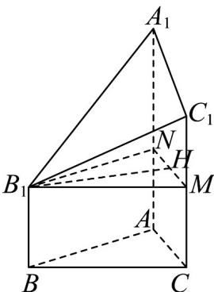
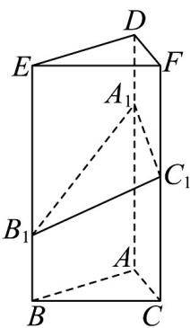

> [!faq]- 《专题21_立体几何初步及复数精选压轴60题12类考点专练_期中复习专项》官方解析
>
> > [!success]- **【答案】** $16 \sqrt{3}$
>
> > [!note]- **【解析】**
> > 解法 1：分别在 $AA_{1}, CC_{1}$ 上取点 N, M，使得 $CM = AN = BB_{1}$ ，连接 $B_{1}N$ ，NM， $B_{1}M$ ，所以平面 $ABC \parallel$ 平面 $B_{1}NM$ ，
> >
> > 取 MN 的中点 H，连接 $B_{1}H$ ，因为 $C_{1}M \perp$ 平面 ABC，
> >
> > 所以 $C_1M \perp$ 平面 $B_1NM, B_1H \subset$ 平面 $B_1NM$ ，所以 $C_1M \perp B_1H$
> >
> > 又因为 $B_{1}H \perp MN, C_{1}MI$ $MN = M, C_{1}M, MN \subset$ 平面 $A_{1}NMC_{1}$
> >
> > 所以 $B_{1}H \perp$ 平面 $A_{1}NMC_{1}$ ， $S_{\triangle ABC} = \frac{1}{2} \times 4 \times 2\sqrt{3} = 4\sqrt{3}$ ， $S_{\text{梯形} A_{1}NMC_{1}} = \frac{2 + 4}{2} \times 4 = 12$
> >
> > $V = V_{ABC - NB_1M} + V_{B_1 - A_1NMC_1} = S_{\triangle ABC}\cdot BB_1 + \frac{1}{3}\cdot S_{\text{梯形}A_1NMC_1}\cdot B_1H$ ∴所求几何体的体积为
> >
> > $$
> > = 4 \sqrt {3} \times 2 + \frac {1}{3} \times 1 2 \times 2 \sqrt {3} = 1 6 \sqrt {3}
> > $$
> >
> > 
> >
> > 解法2：因为在几何体 $ABC - A_{1}B_{1}C_{1}$ 中，侧棱 $AA_{1},BB_{1},CC_{1}$ 均垂直于底面 $ABC$
> >
> > 又 $AB = BC = AC = CC_{1} = 4, BB_{1} = 2, AA_{1} = 6$
> >
> > 所以可构造一个底面是边长为 4 的等边三角形，侧棱长为 8 的正三棱柱 ABC-DEF
> >
> > 其中， $B_{1}E=8-2=6=AA_{1},A_{1}D=8-6=2=BB_{1},C_{1}F=8-4=4=CC_{1}$
> >
> > 因此 $V_{ABC-A_{1}B_{1}C_{1}} = V_{A_{1}B_{1}C_{1}-DEF}$ ，即 $V_{ABC-A_{1}B_{1}C_{1}} = \frac{1}{2} V_{ABC-DEF}$ ，
> >
> > 根据三棱柱体积公式， $V_{ABC-DEF}=\frac{1}{2}\times4\times4\times\sin60^{\circ}\times8=32\sqrt{3}$
> >
> > 故该几何体的体积是 $V_{ABC-A_{1}B_{1}C_{1}}=\frac{1}{2}\times32\sqrt{3}=16\sqrt{3}$
> >
> > 
