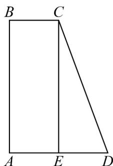

> [!faq]- 《专题21_立体几何初步及复数精选压轴60题12类考点专练_期中复习专项》官方解析
>
> > [!success]- **【答案】** $$ \sqrt {1 7} \quad \frac {2 8}{3} \pi $$
>
> > [!note]- **【分析】**
> > 由斜二测画法原理可得平面图形 ABCD 是直角梯形，进而可求 CD；直角梯形 ABCD 以 AB 所在
> >
> > 直线为轴旋转一周所得立体图形为圆台，可求其体积即可。
>
> > [!note]- **【解析】**
> > 由平面图形的直观图的斜二测画法原理可知，平面图形ABCD是直角梯形，如图：
> >
> > 
> >
> > 其中 $AB = 2A'B' = 4$ ， $BC = B'C' = 1$ ， $AD = A'D' = 2$ ， $AB \perp AD$
> >
> > 过 C 作 $CE \perp AD$ 交 AD 于 E，则 E 为 AD 的中点，
> >
> > 在Rt△CED中，CE=AB=4， $ED=\frac{1}{2}AD=1$
> >
> > 所以 $CD = \sqrt{CE^2 + ED^2} = \sqrt{17}$
> >
> > 将直角梯形ABCD以 $AB$ 所在直线为轴旋转一周所得立体图形为圆台，
> >
> > 其上底面圆的半径为 $BC = 1$ ，下底面圆的半径为 $AD = 2$ ，高为 $AB = 4$
> >
> > 故此圆台体积为 $V = \frac{1}{3} \times \left( \pi + 4\pi + \sqrt{\pi \cdot 4\pi} \right) \times 4 = \frac{28}{3}\pi$
> >
> > 故答案为： $\sqrt{17}$ ； $\frac{28}{3}\pi$
