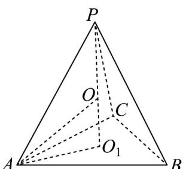

> [!faq]- 《专题21_立体几何初步及复数精选压轴60题12类考点专练_期中复习专项》官方解析
>
> > [!success]- **【答案】** A. $\frac{3}{2}$ B. $\frac{\sqrt{6}}{2}$ C. $\frac{5}{2}$ D. $\frac{3\sqrt{2}}{2}$
>
> > [!note]- **【分析】**
> > 由 $PA = PB = PC$ 可知顶点 $P$ 在底面 $ABC$ 的投影为 $\triangle ABC$ 的外心（正三角形的中心），外接球的球心在过该中心且垂直于底面的直线上，通过勾股定理建立方程求解半径.【详解】如图，设点 $O_{1}$ 为底面 $ABC$ 的投影，因为 $AB = AC = BC = 2\sqrt{3}$ ，
>
> > [!note]- **【解析】**
> > 
> > 则 $O_{1}$ 为正三角形 $ABC$ 的中心，计算可得 $AO_{1} = \frac{\sqrt{3}}{3} \times 2\sqrt{3} = 2$
> > 则 $PO_{1} \perp$ 平面 ABC ，连接 $AO_{1}$
> > $$
> > \text { 在 } R t \triangle P O _ {1} A \text { 中   ， } P A = P B = P C = 2 \sqrt {5}:
> > $$
> > $$
> > P O _ {1} = \sqrt {P A ^ {2} - A O _ {1} ^ {2}} = \sqrt {(2 \sqrt {5}) ^ {2} - 2 ^ {2}} = \sqrt {2 0 - 4} = \sqrt {1 6} = 4
> > $$
> > 设外接球的球心为 O，半径为 R，则 O 在直线 $PO_{1}$ 上.
> > 设 $OO_{1}=d$ ，则 $PO=\left|4-d\right|=OA=R$
> > 在 $Rt\triangle OO_{1}A$ 中： $R^2 = 4 + d^2 = (4 - d)^2$ 解得： $d = \frac{3}{2}$
> > 所以 $R^{2}=4+\left(\frac{3}{2}\right)^{2}=4+\frac{9}{4}=\frac{25}{4}$ ，即 $R=\frac{5}{2}$ .
> > 所以三棱锥 P-ABC 外接球的半径为 $\frac{5}{2}$ .
