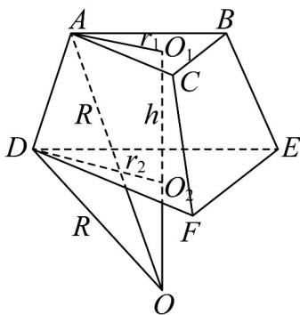

> [!faq]- 《专题21_立体几何初步及复数精选压轴60题12类考点专练_期中复习专项》官方解析
>
> > [!success]- **【答案】** $20\pi$
>
> > [!note]- **【分析】**
> > 根据条件及三棱台的体积公式，可得正三棱台的高，根据正三棱台的性质及勾股定理，可得外接球的
> >
> > 球心到下底面的距离，进而可得外接球的半径 R，代入表面积公式，即可得答案.
>
> > [!note]- **【解析】**
> > 因为正三棱台的上、下底面边长分别为 $\sqrt{3}$ 、 $2\sqrt{3}$
> >
> > 所以上底面面积 $S_{1} = \frac{\sqrt{3}}{4}\times (\sqrt{3})^{2} = \frac{3\sqrt{3}}{4}$ ，下底面面积 $S_{2} = \frac{\sqrt{3}}{4}\times (2\sqrt{3})^{2} = 3\sqrt{3}$
> >
> > 设正三棱台的高为 $h$ ，则体积 $V = \frac{1}{3}\left(S_1 + S_2 + \sqrt{S_1S_2}\right)\cdot h = \frac{7\sqrt{3}}{4}$
> >
> > 则 $\frac{1}{3}\left(\frac{3\sqrt{3}}{4} + 3\sqrt{3} + \sqrt{\frac{3\sqrt{3}}{4} \times 3\sqrt{3}}\right) \cdot h = \frac{7\sqrt{3}}{4}$ ，解得 $h = 1$ ，
> >
> > 上底面的中心到顶点 $A$ 的距离 $r_1 = \frac{2}{3} \times \frac{\sqrt{3}}{2} \times \sqrt{3} = 1$
> >
> > 下底面的中心到顶点 $D$ 的距离 $r_2 = \frac{2}{3} \times \frac{\sqrt{3}}{2} \times 2\sqrt{3} = 2$
> >
> > 因为 $r_1^2 + r_2^2 > h^2$ ，所以外接球球心 $O$ 位于底面 $DEF$ 的下方，
> >
> > 设外接球球心到下底面的距离为 $d$ ，则到上底面的距离为 $d + 1$ ，设外接球的半径为 $R$ ，
> >
> > 则 $\left\{ \begin{array}{l} R^2 = r_2^2 + d^2 \\ R^2 = r_1^2 + (d + 1)^2 \end{array} \right.$ 即 $\left\{ \begin{array}{l} R^2 = 2^2 + d^2 \\ R^2 = 1^2 + (d + 1)^2 \end{array} \right.$ ，解得 $d = 1$ ，则 $R = \sqrt{5}$ ，
> >
> > 所以外接球的表面积为 $S = 4\pi R^{2} = 20\pi$
> >
> > 
