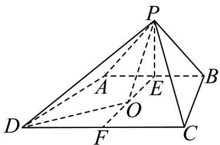
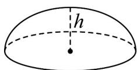
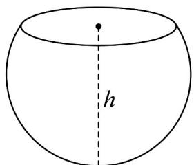

> [!faq]- 《专题21_立体几何初步及复数精选压轴60题12类考点专练_期中复习专项》官方解析
>
> > [!success]- **【答案】** C
>
> > [!note]- **【分析】**
> > 根据条件，分析可得四边形ABCD必为等腰梯形，即可求出所需长度，分析可得，梯形ABCD
> >
> > 的面积为定值，要使四棱锥 $P - ABCD$ 的体积最大，必有 $PE \perp$ 平面 $ABCD$ ，则球心 $O$ 在 $EF$ 上，根据勾股
> >
> > 定理，求出半径 R，代入公式，即可得答案.
>
> > [!note]- **【解析】**
> > 由题意可得 A, B, C, D 共圆，且 $AB \parallel CD$
> >
> > 所以四边形 ABCD 必为等腰梯形，如图所示，
> >
> > 
> >
> > 取 $AB$ 中点 $E$ ， $CD$ 中点 $F$ ，则 $EF \perp AB$ ，
> >
> > 因为 $AB = 6, CD = 8$ ， $\cos \angle ADC = \frac{\sqrt{2}}{10}$ ，则 $\tan \angle ADC = 7$
> >
> > 所以 $\tan\angle ADC=\frac{EF}{(DF-AE)}=\frac{EF}{1}$ ，则 EF=7，
> >
> > 所以梯形ABCD的面积为定值.
> >
> > 因为 $\triangle PAB$ 是等腰直角三角形， $E$ 为斜边 $AB$ 的中点， $AB = 6$ ，所以 $PE = 3$
> >
> > 要使四棱锥 $P - ABCD$ 的体积最大，必有 $PE \perp$ 平面 $ABCD$ ，此时 $EF \perp$ 平面 $PAB$
> >
> > 而点 E 为 $\triangle PAB$ 的外心，因此球心 O 在 EF 上，
> >
> > 设 OE = x ，球 O 的半径为 R ，
> >
> > 则 $R^2 = PE^2 + OE^2 = OF^2 + FD^2$ ，即 $R^2 = 3^2 + x^2 = (7 - x)^2 + 4^2$ ，解得 $x = 4$
> >
> > 所以 $R^{2}=25$ ，球 O 的表面积 $S=4\pi R^{2}=100\pi$
> >
> > 19．球体被平面截得的一部分几何体称为球缺，截面叫做球缺的底面，垂直于截面的直径被截得的线段长叫做球缺的高（如图）．若球缺的底面半径为 $r$ ，高为 $h$ ，则球缺的体积 $V = \frac{1}{6}\pi h\left(3r^2 +h^2\right)$ ．已知棱长为2的正方体 $ABCD - A_{1}B_{1}C_{1}D_{1}$ 的各个顶点都在球 $O$ 上，平面ABCD将球 $O$ 截成两部分，那么较小部分的
> >
> > 体积为（ ）
> >
> > 
> >
> > 
> >
> > A. $\frac{6\sqrt{3} - 8}{3}\pi$ B. $\frac{8 - 4\sqrt{3}}{3}\pi$ C. $2(\sqrt{3} -1)\pi$ D. $\frac{4\sqrt{3} - 4}{3}\pi$
> >
> > 【答案】A
> >
> > 【分析】根据题意可得球的半径以及平面ABCD截外接球所得圆的半径，然后求出球心与截面圆的圆心
> >
> > 间距离，再求出球缺的高，最后代入公式求解结果.
> >
> > 【详解】设外接球圆心为 O，平面 ABCD 截外接球所得圆圆心为 $O_{1}$
> >
> > 由题意正方体外接球的半径 $R = \sqrt{3}$ ，平面ABCD截外接球所得圆的半径为 $r = \sqrt{2}$
> >
> > $O_{到}O_{1}$ 的距离 $d=\sqrt{3-2}=1$ ，则球缺的高 $h=\sqrt{3}-1$
> >
> > 所以 $V=\frac{1}{6}\pi\left(\sqrt{3}-1\right)\left(3\left(\sqrt{2}\right)^{2}+\left(\sqrt{3}-1\right)^{2}\right)=\frac{6\sqrt{3}-8}{3}\pi$
