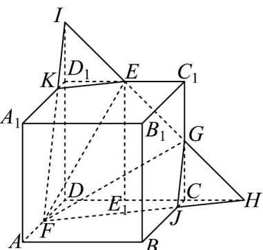

> [!faq]- 《专题21_立体几何初步及复数精选压轴60题12类考点专练_期中复习专项》官方解析
>
> > [!success]- **【答案】** A. $\frac{1313}{1616}$ B. $\frac{59}{72}$ C. $\frac{119}{144}$ D. $\frac{49}{72}$
>
> > [!note]- **【分析】**
> > 首先作出过 $E$ ， $F$ ， $G$ 三点的截面为五边形 EKFJG ，根据相似，求解长度，根据体积公式即可求解
> >
> > 求解.
>
> > [!note]- **【解析】**
> > 如图，延长EG，DC相交于H，连接FH，交BC于J，同理可作 $FK$ ，则 $E$ ， $F$ ， $G$ 三点的截面为五边形 $EKFJG$ ，不妨设正方体棱长为1，则 $\triangle HCG \sim \triangle EC_1G$ ，所以 $CH = \frac{1}{2}$ 又 $\triangle HCJ \sim \triangle HDF$ ，所以 $JC = \frac{1}{6}$ 同理可得 $D_1I = \frac{1}{2}, KD_1 = \frac{1}{6}$ 可知截得较小部分体积 $V = V_{I-DFH} - 2V_{I-KD_1E}$ 所以 $V = \frac{1}{3} \times \frac{1}{2} \left( \frac{3}{2} \times \frac{1}{2} \right) \times \frac{3}{2} - 2 \times \frac{1}{3} \times \frac{1}{2} \left( \frac{1}{2} \times \frac{1}{6} \right) \times \frac{1}{2} = \frac{3}{16} - \frac{1}{72} = \frac{25}{144}$ 又立方体体积为1，所以较大部分与总体积之比为 $1 - \frac{25}{144} = \frac{119}{144}$ 故选：C.
> >
> > 
