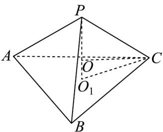

> [!faq]- 《专题21_立体几何初步及复数精选压轴60题12类考点专练_期中复习专项》官方解析
>
> > [!success]- **【答案】** A. $\frac{7\sqrt{6}\pi}{4}$ B. $\frac{7\sqrt{6}\pi}{8}$ C. $\frac{\sqrt{6}\pi}{2}$ D. $\sqrt{6}\pi$
>
> > [!note]- **【分析】**
> > 根据给定条件，利用正四面体的结构特征求出其外接球半径，球缺的高，再代入求出体积。
>
> > [!note]- **【解析】**
> > 如图，记正四面体PABC的外接球球心为O，半径为R，VABC外接圆圆心为 $O_{1}$ ，
> > 则 $PO_{1} \perp$ 平面 ABC， $O_{1}C = \frac{3}{2\sin60^{\circ}} = \sqrt{3}$ ， $PO_{1} = \sqrt{PC^{2} - O_{1}C^{2}} = \sqrt{6}$ ，
> >
> > $(|PO_{1} - R|)^{2} + O_{1}C^{2} = R^{2}$ ，解得 $R = \frac{3\sqrt{6}}{4}$ $OO_{1} = PO_{1} - R = \frac{\sqrt{6}}{4}$ $h = R - OO_{1} = \frac{\sqrt{6}}{2}$ 所以球缺的体积为 $V = \frac{\pi}{3}(3R - h)h^2 = \frac{\pi}{3}\cdot (\frac{9\sqrt{6}}{4} -\frac{\sqrt{6}}{2})\cdot (\frac{\sqrt{6}}{2})^2 = \frac{7\sqrt{6}\pi}{8}$
> >
> > 故选：B
> >
> > 
