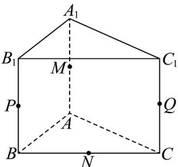
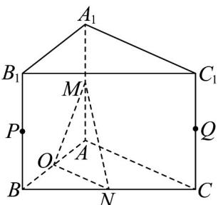

> [!faq]- 《专题21_立体几何初步及复数精选压轴60题12类考点专练_期中复习专项》官方解析
>
> > [!success]- **【答案】**  A. $P, Q, M, N$ 四点共面 B. 线段 $BC_{1}$ 为直三棱柱 $ABC - A_{1}B_{1}C_{1}$ 外接球的直径 C. 三棱锥 $P - AQN$ 的体积为 $\frac{2}{3}$ D. 异面直线 $MN$ 与 $AC$ 所成角为 $\frac{\pi}{6}$
>
> > [!note]- **【分析】**
> > 由异面直线的判定判断 A；补形为正方体判断 B；利用等体积法求出体积判断 C；求出异面直线夹角判断 D.
>
> > [!note]- **【解析】**
> > 对于 A，直线 $QN \in$ 平面 $BCC_{1}B_{1}$ ，点 $P \in$ 平面 $BCC_{1}B_{1}$ ，而 $P \notin$ 直线 QN
> >
> > 点 $M \notin$ 平面 $BCC_{1}B_{1}$ ，因此直线 $PM$ 与直线 $QN$ 是异面直线，则 $P, M, Q, N$ 四点不共面，A 错误；
> >
> > 对于 B，将三棱柱 $ABC-A_{1}B_{1}C_{1}$ 补形为正方体，AB, AC, $AA_{1}$ 为该正方体共点的三条棱，
> >
> > 矩形 $BCC_{1}B_{1}$ 为该正方体对角面，则 $BC_{1}$ 为三棱柱 $ABC-A_{1}B_{1}C_{1}$ 外接球直径，B 正确；
> >
> > 对于 C，点 A 到平面 $BCC_{1}B_{1}$ 的距离为 $\sqrt{2}$ 则 $V_{P - AQN} = V_{A - PQN} = \frac{1}{3}\times \frac{1}{2}\times 2\sqrt{2}\times 1\times \sqrt{2} = \frac{2}{3}$ ，C正确；
> > 对于D，取 $AB$ 中点 $O$ ，连接 $OM,ON$ ，由 $N$ 是 $BC$ 中点，得 $ON / / AC$ ，
> > 则∠MNO是异面直线MN与AC所成角或其补角，
> > 由已知 $AC\perp AB$ ， $AC\perp AA_{1}$ ， $AB\cap AA_{1} = A$ ， $AB,AA_{1}\subset$ 平面 $ABB_{1}A_{1}$ ，
> > 所以 $AC\perp$ 平面 $ABB_{1}A_{1}$ ，故 $ON\perp$ 平面 $ABB_{1}A_{1}$ ，
> > 又 $OM\subset$ 平面 $ABB_{1}A_{1}$ ，于是 $ON\perp OM$ ，而 $ON = \frac{1}{2} AC = 1,OM = \sqrt{1^2 + 1^2} = \sqrt{2}$ ，
> > 因此 $\tan \angle MNO = \sqrt{2}\neq \frac{\sqrt{3}}{3}$ ，即 $\angle MNO\neq \frac{\pi}{6}$ ，D错误.
> >
> > 
