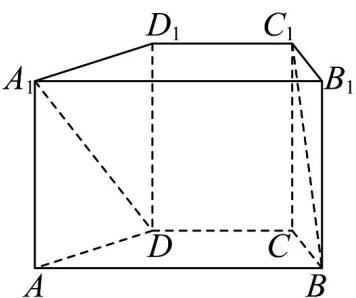
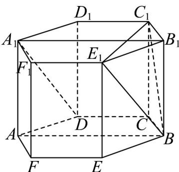

> [!faq]- 《专题21_立体几何初步及复数精选压轴60题12类考点专练_期中复习专项》官方解析
>
> > [!success]- **【答案】**  A. $30^{\circ}$ B. $45^{\circ}$ C. $60^{\circ}$ D. $90^{\circ}$
>
> > [!note]- **【分析】**
> > 通过补形，得到正六棱柱 $ADCBEF-A_{1}D_{1}C_{1}B_{1}E_{1}F_{1}$ ，继而得到 $\angle C_{1}BE_{1}$ 即为直线 $A_{1}D$ 与 $BC_{1}$ 所成的
> >
> > 角或其补角．设 CD=1 ，从而得到 $\triangle C_{1}BE_{1}$ 为正三角形，故 $\angle C_{1}BE_{1}=60^{\circ}$ ，从而得到所求.
>
> > [!note]- **【解析】**
> > 如图，将直四棱柱 $ABCD - A_{1}B_{1}C_{1}D_{1}$ 补成正六棱柱 $ADCBEF - A_{1}D_{1}C_{1}B_{1}E_{1}F_{1}$
> >
> > 连接 $BE_{1}$ ， $C_{1}E_{1}$ ，显然 $BE_{1} \parallel A_{1}D$
> >
> > 则 $\angle C_{1}BE_{1}$ 即为直线 $A_{1}D$ 与 $BC_{1}$ 所成的角或其补角.
> >
> > 设 $CD = 1$ ，则 $C_1D_1 = C_1B_1 = E_1B_1 = 1$
> >
> > $$
> > \text {又} \angle C _ {1} B _ {1} E _ {1} = 1 2 0 ^ {\circ}
> > $$
> >
> > 则 $\left(C_1E_1\right)^2 = \left(C_1B_1\right)^2 +\left(E_1B_1\right)^2 -2C_1B_1\cdot E_1B_1\cos \angle C_1B_1E_1 = 1^2 +1^2 -2\times 1\times 1\cos 120^\circ = 3$
> >
> > 解得 $C_{1}E_{1}=\sqrt{3}$ ，
> >
> > $$
> > B E _ {1} = \sqrt {\left(B B _ {1}\right) ^ {2} + \left(B _ {1} E _ {1}\right) ^ {2}} = \sqrt {\left(\sqrt {2}\right) ^ {2} + 1 ^ {2}} = \sqrt {3}
> > $$
> >
> > $$
> > B C _ {1} = \sqrt {\left(B B _ {1}\right) ^ {2} + \left(B _ {1} C _ {1}\right) ^ {2}} = \sqrt {\left(\sqrt {2}\right) ^ {2} + 1 ^ {2}} = \sqrt {3}
> > $$
> >
> > 则 $\triangle C_{1}BE_{1}$ 为正三角形，从而 $\angle C_{1}BE_{1}=60^{\circ}$
> >
> > 则直线 $A_{1}D$ 与 $BC_{1}$ 所成的角为 $60^{\circ}$
> >
> > 
