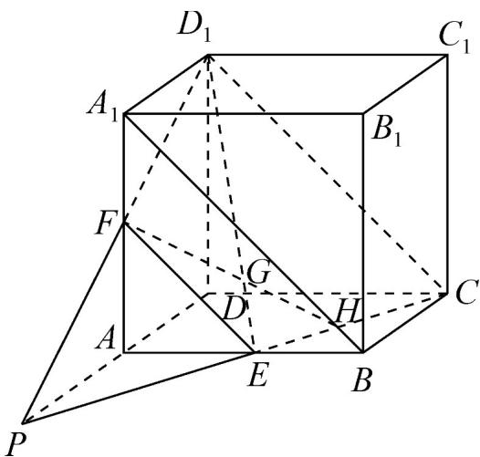

> [!faq]- 《专题21_立体几何初步及复数精选压轴60题12类考点专练_期中复习专项》官方解析
>
> > [!success]- **【答案】** (1)证明见解析； (2)证明见解析
>
> > [!note]- **【分析】**
> > （1）连接 $A_{1}B$ ， $CD_{1}$ ，可得到 $EF / / CD_{1}$ 且 $EF \neq CD_{1}$ ，则 $EC$ 与 $D_{1}F$ 相交，设交点为 $P$ ，则能得到
> >
> > $P \in$ 平面 $ABCD$ ， $P \in$ 平面 $ADD_{1}A_{1}$ ，结合平面 $ABCD \cap$ 平面 $ADD_{1}A_{1} = AD$ ，即可得证；
> >
> > (2) 可证明 $P, E, H$ 都在平面 $PCD_{1}$ 与平面 $ABCD$ 的交线上，即可得证
>
> > [!note]- **【解析】**
> > （1）证明：连接 $A_{1}B$ ， $CD_{1}$ ，EF
> >
> > 正方体 $ABCD - A_{1}B_{1}C_{1}D_{1}$ 中，E，F 分别是 AB， $AA_{1}$ 的中点，
> >
> > $\therefore EF//A_{1}B$ 且 $EF \neq A_{1}B$
> >
> > $$
> > \therefore C D _ {1} / / A _ {1} B \text {目} C D _ {1} = A _ {1} B
> > $$
> >
> > $$
> > \therefore E F / / C D _ {1} \text {且} E F \neq C D _ {1}
> > $$
> >
> > $\therefore EC$ 与 $D_{1}F$ 相交，设交点为 P，
> >
> > $\because P \in EC, EC \subset$ 平面 $ABCD, \therefore P \in$ 平面 $ABCD$ ;
> >
> > 又∵ $P\in FD_{1}$ ， $FD_{1}\subset$ 平面 $ADD_{1}A_{1}$ ，∴ $P\in$ 平面 $ADD_{1}A_{1}$ ，
> >
> > $\therefore P$ 为两平面的公共点，
> >
> > ∵平面 $ABCD \cap$ 平面 $ADD_{1}A_{1} = AD$ ，∴ $P \in AD$ ，
> >
> > $\therefore CE、D_{1}F、DA$ 三线交于点 P；
> >
> > (2)
> >
> > 
> >
> > 在（1）的结论中，G 是 $D_{1}E$ 上一点，FG 交平面 ABCD 于点 H，
> >
> > 则 $FH \subset$ 平面 $PCD_{1}$ ，∴ $H \in$ 平面 $PCD_{1}$ ，又 $H \in$ 平面 ABCD，
> >
> > $\therefore H \in \text{平面 } PCD_{1} \cap \text{ 平面 } ABCD$
> >
> > 同理， $P \in$ 平面 $PCD_{1} \cap$ 平面 $ABCD$
> >
> > $E \in_{平面} PCD_{1} \cap$ 平面 ABCD，
> >
> > $\therefore P, E, H$ 都在平面 $PCD_{1}$ 与平面 $ABCD$ 的交线上，
> >
> > $\therefore P, E, H$ 三点共线.
