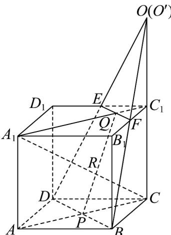
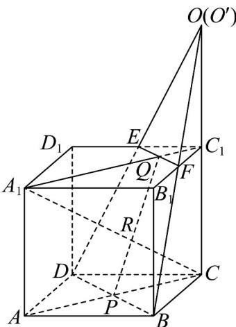

> [!faq]- 《专题21_立体几何初步及复数精选压轴60题12类考点专练_期中复习专项》官方解析
>
> > [!success]- **【答案】** (1)证明见解析 <!-- source-part:2 pages:51-100 --> (2)答案见解析
>
> > [!note]- **【分析】**
> > （1）说明 $DE \cap BF = O$ ，再由两条相交直线可以确定平面即可求证；
> >
> > (2) 利用公理 2 说明三点在两个平面的交线上即可.
>
> > [!note]- **【解析】**
> > （1）由于 $CC_{1}$ 和BF在同一个平面内且不平行，故必相交.
> >
> > 如图，设交点为 O，因为 F 为 $B_{1}C_{1}$ 的中点，所以 $FC_{1} // CB$ 且 $FC_{1} = \frac{1}{2} BC$ ，即 $FC_{1}$ 是 $\triangle BCO$ 的中位线，则 $OC_{1} = C_{1}C$
> >
> > 
> >
> > 同理直线 DE 与 $CC_{1}$ 也相交，设交点为 $O'$ ，则 $O'C_{1}=C_{1}C$ ，故 $O'$ 与 O 重合。
> >
> > 由此可证得 $DE \cap BF = O$ ，故 D, B, F, E 四点共面。
> >
> > (2) 设平面 DBFE 为 $\alpha$ 。由于 $AA_{1} // CC_{1}$
> >
> > 所以 $A_{1}$ ，A，C， $C_{1}$ 四点共面（设为 $\beta$ ）.
> >
> > 因为 $P \in BD$ ， $BD \subset \alpha$ ，所以 $P \in \alpha$
> >
> > 又 $P \in AC$ ， $AC \subset \beta$ ，所以 $P \in \beta$
> >
> > 所以 $P \in (\alpha \cap \beta)$
> >
> > 同理可证得 $Q \in (\alpha \cap \beta)$ ，从而有 $\alpha \cap \beta = PQ$
> >
> > 连接 $A_{1}C$ ，交 PQ 于点 R，因为 $A_{1}C \subset \beta$ ，
> >
> > 所以 $A_{1}C$ 与平面 $\alpha$ 的交点就是 $A_{1}C$ 与 PQ 的交点.
> >
> > 所以 $A_{1}C$ 与 PQ 的交点 R 就是所求的交点.
> >
> > 
