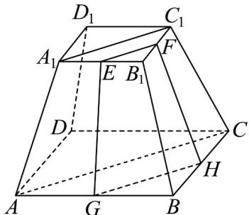

> [!faq]- 《专题21_立体几何初步及复数精选压轴60题12类考点专练_期中复习专项》官方解析
>
> > [!success]- **【答案】** (1)相交，理由见解析； (2)证明见解析.
>
> > [!note]- **【分析】**
> > （1）利用中位线和棱台的结构特征，证明 $EF / / GH$ ，可得以 $E, F, G, H$ 四点共面，进而得出 $EFHG_{\text{为梯形，则}}FG_{\text{与}}EH_{\text{必相交；}}$
> >
> > (2) 由 EFHG 为梯形，则 EG 与 FH 必相交，证明交点在 $BB_{1}$ 上即可.
>
> > [!note]- **【解析】**
> > （1）证明：连接 $AC$ ， $A_{1}C_{1}$ ，如图所示，
> >
> > 
> >
> > 因为 $ABCD-A_{1}B_{1}C_{1}D_{1}$ 为正四棱台，所以 $A_{1}C_{1} // AC$
> >
> > 又 E, F, G, H 分别为棱 $A_{1}B_{1}$ , $B_{1}C_{1}$ , AB, BC 的中点，所以 $EF // A_{1}C_{1}$ , GH // AC,
> >
> > 则 $EF // GH$ ，所以 $E, F, G, H$ 四点共面，因为 $A_{1}C_{1} \neq AC$ ，所以 $EF \neq GH$
> >
> > 所以 EFHG 为梯形，则 FG 与 EH 必相交。
> >
> > (2) 因为 EFHG 为梯形，则 FH 与 GE 必相交。
> >
> > 设 $GE \cap FH = P$ ，因为 $GE \subset \text{平面} AA_1B_1B$ ，所以 $P \in \text{平面} AA_1B_1B$
> >
> > 因为 $FH \subset$ 平面 $BB_{1}C_{1}C$ ，所以 $P \in$ 平面 $BB_{1}C_{1}C$ ，
> >
> > 又平面 $AA_{1}B_{1}B$ 平面 $BB_{1}C_{1}C = BB_{1}$
> >
> > 所以 $P \in BB_{1}$ ，则 $GE$ ， $FH$ ， $BB_{1}$ 交于一点。
