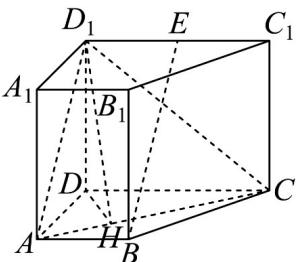

> [!faq]- 《专题21_立体几何初步及复数精选压轴60题12类考点专练_期中复习专项》官方解析
>
> > [!success]- **【答案】** (1)证明见解析 (2) $\arctan\frac{5}{3}$
>
> > [!note]- **【分析】**
> > （1）通过证明 $BE//AD_{1}$ ，得证 $BE//$ 平面 $AA_{1}D_{1}D$ ；
> >
> > (2) 过 D 作 $DH \perp AC$ ，则 $\angle D_{1}HD$ 即为所求，利用直角三角形的性质计算出 $\tan \angle D_{1}HD$ 即可.
>
> > [!note]- **【解析】**
> > （1）连接 $AD_{1}$ ，直四棱柱 $ABCD - A_{1}B_{1}C_{1}D_{1}$ 中， $D_{1}E//DC//AB$ ， $D_{1}C_{1} = DC$
> >
> > $E$ 是 $C_1D_1$ 的中点， $D_1E = \frac{1}{2} DC = 2$ ，则 $D_1E = AB$ ，所以 $AD_1EB$ 为平行四边形，
> >
> > 则有 $BE // AD_{1}$ ，又 $BE \notin$ 平面 $AA_{1}D_{1}D$ ， $AD_{1} \subset$ 平面 $AA_{1}D_{1}D$
> >
> > 所以 $BE \parallel$ 平面 $AA_{1}D_{1}D$ ；
> >
> > 
> >
> > (2) 梯形 ABCD 的面积 $S = \frac{1}{2} \times (2 + 4) \times 3 = 9$ ,
> >
> > $V_{ABCD - A_1B_1C_1D_1} = S \cdot AA_1 = 36$ ，则 $AA_1 = 4$
> >
> > 过 $D$ 作 $DH \perp AC$ ，交 $AC$ 于 $H$ ，连接 $D_{1}H$
> >
> > 直四棱柱 $ABCD - A_{1}B_{1}C_{1}D_{1}$ 中， $DD_{1} \perp$ 平面 ABCD，则 DH 为 $D_{1}H$ 在平面 ABCD 内的射影，
> >
> > 由 $DH \perp AC$ ，有 $D_{1}H \perp AC$ ，所以 $\angle D_{1}HD$ 即为所求，
> >
> > Rt△ACD 中，AD=3,CD=4，有 AC=5，又 $AC\cdot DH=AD\cdot CD$ ，则 $DH=\frac{12}{5}$
> >
> > $\tan \angle D_{1}HD = \frac{DD_{1}}{DH} = \frac{AA_{1}}{DH} = \frac{4}{\frac{12}{5}} = \frac{5}{3}$ 所以锐角 $\angle D_{1}HD = \arctan \frac{5}{3}$ .
