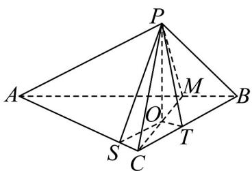
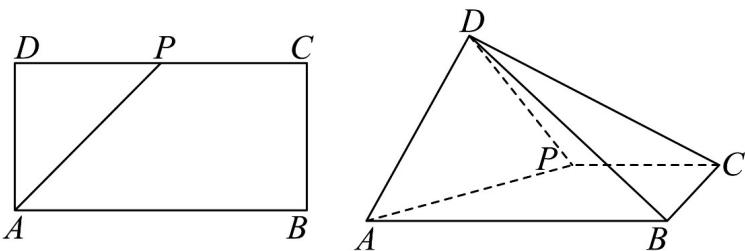
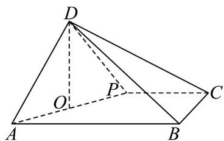
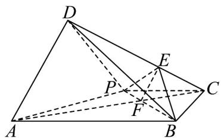

> [!faq]- 《专题21_立体几何初步及复数精选压轴60题12类考点专练_期中复习专项》官方解析
>
> > [!success]- **【答案】** (1)证明见解析 (2)证明见解析
>
> > [!note]- **【分析】**
> > （1）根据线面垂直的判定定理证明即可；
> >
> > (2) 过点 O 分别向 AC, BC 引垂线，垂足分别为 S, T，根据线面垂直的性质定理证明 $AC \perp PS$ ，由此可
> >
> > 得 $\alpha = \angle PSO$ ，同理 $\beta = \angle PTO$ ，再计算 $\frac{\tan\beta}{\tan\alpha}$ 即可；
>
> > [!note]- **【解析】**
> > （1）因为 $AC \perp BC$ ，所以 $AB = \sqrt{AC^{2} + BC^{2}} = 5$ .
> >
> > 因为 $\frac{BC}{BM} = \frac{BA}{BC} = \sqrt{5}$ ，所以 $\triangle BCM\sim \triangle BAC$ ，
> >
> > 所以 $\angle BMC = \angle BCA = 90^{\circ}$ ，即 $CM \perp AB$ .
> >
> > 由已知可得 $\triangle APB \cong \triangle ACB$ ，同理，在 $\triangle APB$ 中可证 $PM \perp AB$ 。
> >
> > 又 $PM \cap CM = M$ ，且两直线在平面内，所以 $AB \perp$ 平面 PCM.
> >
> > (2) 由 (1) 知 $AB \perp$ 平面 $PCM$ ，所以平面 $PCM \perp$ 平面 $ABC$
> >
> > 则点 P 在平面 ABC 内的射影 O 在直线 CM 上.
> >
> > 如图，过点 O 分别向 AC, BC 引垂线，垂足分别为 S, T
> >
> > 连接 $PS, PT$ ，则四边形 $OSCT$ 是矩形.
> >
> > 
> >
> > 由于 $AC \perp OS, AC \perp PO, PO \cap OS = O$ ，且两直线在平面内，所以 $AC \perp$ 平面 POS，
> >
> > 从而 $AC \perp PS$ ，因此 $\alpha = \angle PSO$ ，同理 $\beta = \angle PTO$ 。
> >
> > 因此 $\tan \alpha = \frac{PO}{OS},\tan \beta = \frac{PO}{OT}$
> >
> > 从而 $\frac{\tan\beta}{\tan\alpha}=\frac{OS}{OT}=\frac{OS}{SC}=\tan\angle ACM=\tan\angle ABC=2$ ，为定值.
> >
> > 52．矩形ABCD中， $AB = 2AD = 2$ ， $P$ 为线段 $DC$ 的中点，将 $\triangle ADP$ 沿 $AP$ 折起，使得平面 $ADP\bot$ 平面
> >
> > ABCP D-PABC 在新构造的四棱锥中，求解以下问题：
> >
> > 
> >
> > (1)求四棱锥 D-PABC 的体积.
> >
> > (2)求二面角 $P - AD - B$ 的余弦值.
> >
> > (3)在 $DC$ 上是否存在点 $E$ 使得 $AD / /$ 平面 $PBE?$ 若存在，求出点 $E$ 的位置；若不存在，请说明理由；
> >
> > $$
> > \sqrt {2}
> > $$
> >
> > 【答案】(1) 4
> >
> > (2) $\frac{\sqrt{3}}{3}$
> >
> > (3)存在，E 是线段 CD 上靠近点 C 的三等分点
> >
> > 【分析】（1）根据面面垂直的性质定理推出线面垂直，即得出棱锥的高，代入四棱锥的体积公式即得；
> >
> > (2) 先证 $AP \perp BP$ ， $BP \perp$ 平面 $ADP$ ，得 $BP \perp DP$ ，计算 $BD$ ，从而证 $AD \perp DB$ ，得出 $\angle PDB$ 为二面角 $P - AD - B$ 的平面角，在 Rt $\triangle PDB$ 中即得余弦值；
> >
> > （3）设 $AC$ 交 $BP$ 于点 $F$ ，可证 $\frac{CF}{CA} = \frac{PF}{PB} = \frac{1}{3}$ ，因此只要 $\frac{CE}{CD} = \frac{1}{3}$ ，就有 $EF // AD$ ，进而可得 $AD //$ 平面PBE
> >
> > 【详解】（1）
> >
> > 
> >
> > 取 $AP$ 的中点 $O$ ，连接 $DO$ ，在原矩形中，因为 $AB = 2AD = 2$ ，点 $P$ 为 $DC$ 的中点，故 $AD = DP = 1$ ，因为
> >
> > $\triangle ADP$ 是等腰三角形，所以 $DO \perp AP$
> >
> > 翻折后，因为平面 $ADP \perp$ 平面 $ABCP$ ，且平面 $ADP \cap$ 平面 $ABCP = AP$
> >
> > 根据面面垂直的性质定理得： $DO \perp$ 平面 ABCP，即 DO 是四棱锥 D-PABC 的高，
> >
> > 又因为 $AP = \sqrt{AD^2 + DP^2} = \sqrt{1^2 + 1^2} = \sqrt{2}$ ，所以 $DO = \frac{1}{2} AP = \frac{\sqrt{2}}{2}$
> >
> > 又因为 $S_{APCB}=\frac{1+2}{2}\times1=\frac{3}{2}$
> >
> > 所以四棱锥 D-PABC 的体积 $V=\frac{1}{3}\times S_{APCB}\times DO=\frac{1}{3}\times\frac{3}{2}\times\frac{\sqrt{2}}{2}=\frac{\sqrt{2}}{4}$
> >
> > (2) 在矩形 ABCD 中， $AP = BP = \sqrt{2}$ ，AB = 2，
> >
> > $$
> > \therefore A P ^ {2} + B P ^ {2} = A B ^ {2} \quad \therefore A P \perp B P
> > $$
> >
> > 又平面 $ADP \perp$ 平面 ABCP ， $BP \subset$ 平面 ABCP ，平面 $ADP \cap$ 平面 ABCP = AP
> >
> > $\therefore BP \perp$ 平面 ADP ，
> >
> > $$
> > \because D P \subset_ {\text {平面}} A D P \quad , \therefore B P \perp D P
> > $$
> >
> > $$
> > \therefore B D ^ {2} = D P ^ {2} + B P ^ {2} = 1 + 2 = 3
> > $$
> >
> > 在 $\Delta ADB$ 中， $AB^{2} = AD^{2} + BD^{2}$ ， $\therefore AD\perp DB$
> >
> > 又 $PD \perp AD$ ， $PD \subset$ 平面 $ADP$ ， $BD \subset$ 平面 $ADB$ ，平面 $ADP \cap$ 平面 $ADB = AD$
> >
> > $\therefore \angle PDB$ 为二面角 $P-AD-B$ 的平面角，
> >
> > 在Rt△PDB中， $\cos\angle PDB=\frac{DP}{BD}=\frac{1}{\sqrt{3}}=\frac{\sqrt{3}}{3}$
> >
> > ∴二面角 P-AD-B 的余弦值为 $\frac{\sqrt{3}}{3}$
> >
> > (3) 存在．如图所示：
> >
> > 连接 AC 、 BP ，设 AC 交 BP 于点 F ，
> >
> > ∵ $CP \parallel AB$ ，且 $CP = \frac{1}{2} AB$ ，
> >
> > $\therefore \frac{CF}{CA} = \frac{PF}{PB} = \frac{1}{3}$
> >
> > 取 $DC$ 的三等分点 $E$ ，使 $\frac{CE}{CD} = \frac{1}{3}$ ，连接 $EF$ 、 $PE$ 、 $BE$ ，则 $EF // AD$ ：
> >
> > 又 $EF \subset$ 平面 PBE ， AD ∉ 平面 PBE ，
> >
> > $\therefore AD \parallel$ 平面 PBE
> >
> > 故存在满足条件的点 $E$ ，且 $E$ 是线段 $CD$ 上靠近点 $C$ 的三等分点.
> >
> > 
